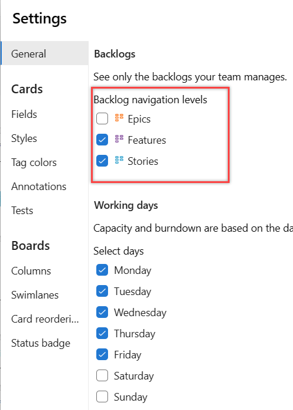

# Select backlog navigation levels

[!INCLUDE [version-lt-eq-azure-devops](../../includes/version-lt-eq-azure-devops.md)]  

Each team has the flexibility to choose and configure multiple backlog levels according to their needs. Feature teams might focus on their product backlog, while management teams might display both feature and epic backlogs (the default portfolio backlogs). You can add and configure these backlog levels through team settings to suit your team's workflow.

If you need more portfolio backlogs, see the following articles based on the process model you use: 
- **Inheritance**: [Customize your backlogs or boards for a process](work/customize-process-backlogs-boards.md)  
- **On-premises XML**: [Add portfolio backlogs](../../reference/add-portfolio-backlogs.md).

For an overview of process models, see [Customize your work tracking experience](../../reference/customize-work.md).

[!INCLUDE [temp](includes/prerequisites-team-settings.md)]

<a id="activate-backlogs"></a>

## Set your team's preferences for backlog levels

This setting affects the backlog and board views for all team members, ensuring a consistent experience across the team. You can modify this setting from either the backlog or board view, depending on your preference. In this article, we show how to adjust the setting from the board view.

1. Sign in to your organization (```https://dev.azure.com/{yourorganization}```).
2. Select **Boards**, and then open your board.

3. Select :::image type="icon" source="../../media/icons/gear-icon.png" border="false"::: **Configure team settings**.

	> [!div class="mx-imgBorder"]
	>   

4. Check the boxes of those backlog levels you want your team to manage. 

	  

5. Select **Save**.  

6. To see the changes, open or refresh your team's [backlog](../../boards/backlogs/create-your-backlog.md). 

::: moniker-end
   Your customized backlog and board view reflect the selected backlog levels.

## Related articles

- [Get started with Agile tools to plan and track work](../../boards/get-started/what-is-azure-boards.md)
- [Understand backlogs, boards, and plans](../../boards/backlogs/backlogs-boards-plans.md)
- [Create your backlog](../../boards/backlogs/create-your-backlog.md)
- [Define features and epics](../../boards/backlogs/define-features-epics.md)
- [Organize your backlog](../../boards/backlogs/organize-backlog.md)
